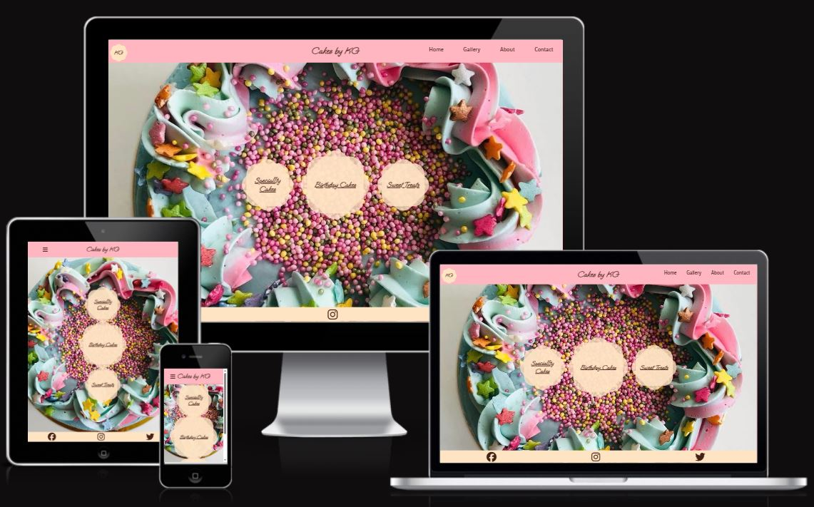
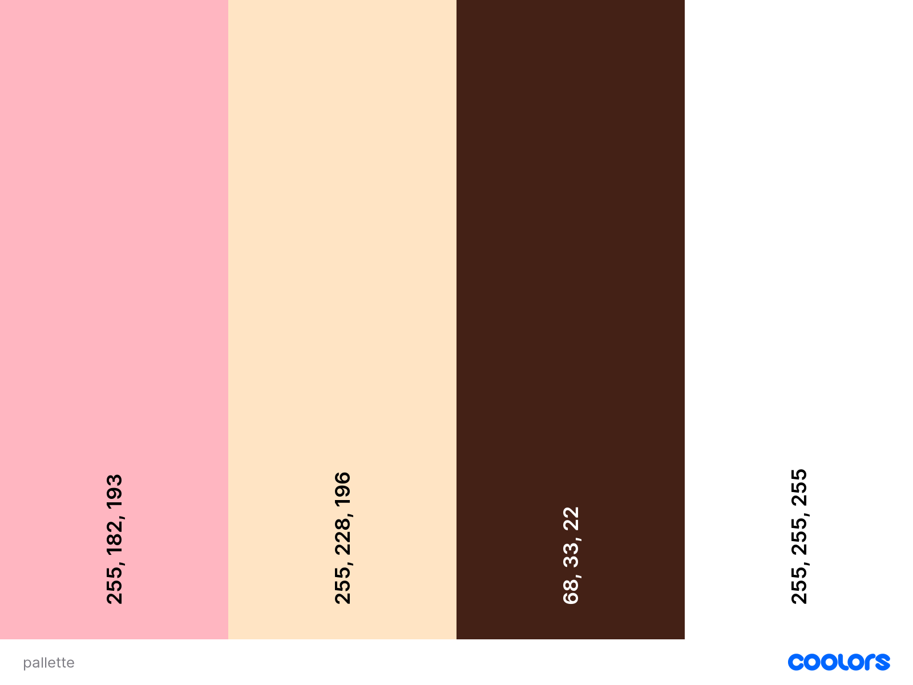
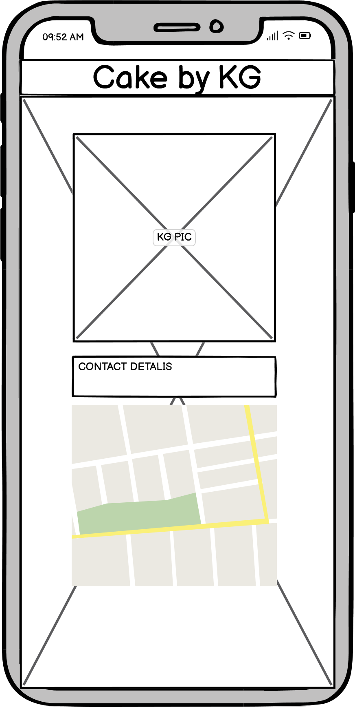
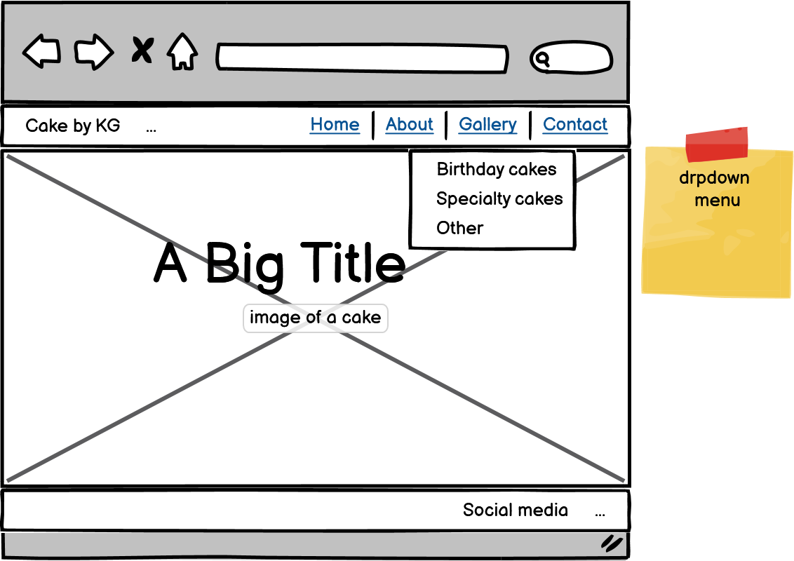
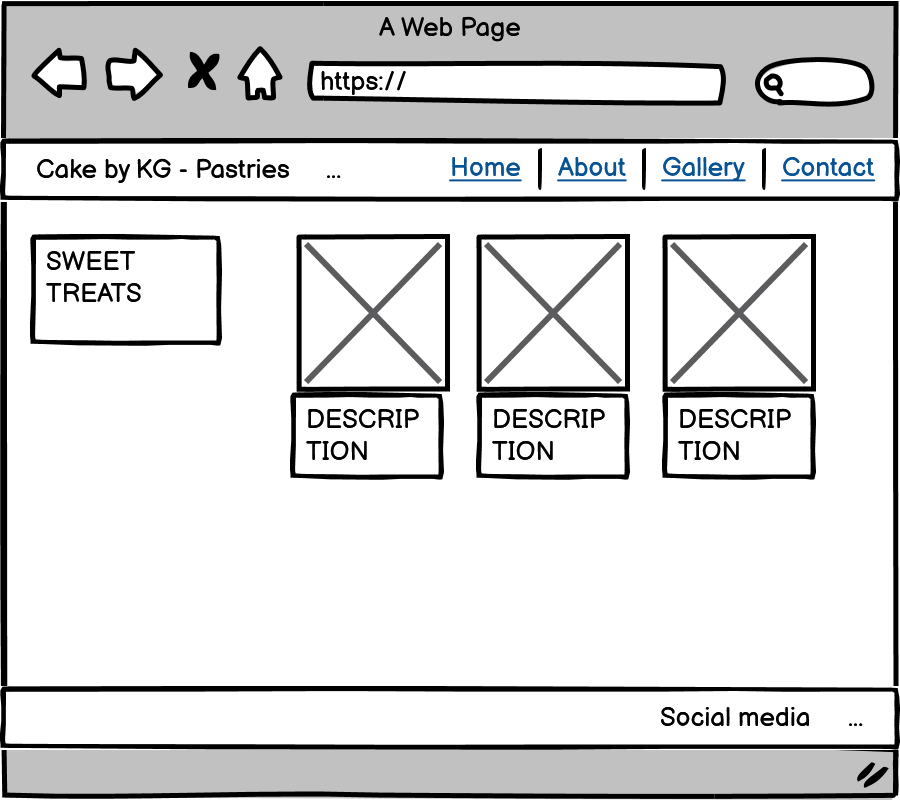
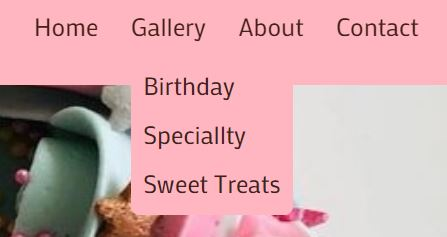
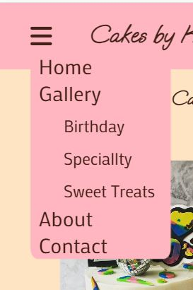

# [CAKES BY KG](https://efthymiakakoulidou.github.io/cakes-by-kg)

Cakes by KG is a website aiming to provide information about the services Katerina Glykou offers which are designing and baking cakes. Apart from the information, the project hopes to inspire the user in the process of chosing a cake. The target audience is people in the Stockholm region who need to order cakes. With the use of picture and contact information the target audience will be able to be inspired choose a cake and order it.

## UX

My aim was to create an accessible and easy-to-navigate website. I wanted it to be welcoming the user to enter a fun and sweet world.

### Colour Scheme

The choice of colours was based on we typically associate to sweet flavors. I chose pink for sugar, beige for cream, brown for chocolate and white. Because of the background image being so colourful I chose not use more colours to tone it down.

- rgb 68,33,22 - Dark brown -used for all text.
- rgb 255,182,193 - Lightpink - used for background to the header and as backround for the galleries so that the images there can be easily seen
- rgb 255,228,196 -Bisque - used for the logo and as background to the text having the needed contrast for accessibility.
.

I used [coolors.co](https://coolors.co/palette/ffb6c1-ffe4c4-8b4513-e0ffff-ffffff) to generate my colour palette.

### Accessibility

This site is accessible in the terms that it uses enough contrast between the text and its background, it is using semantics, alt attributes on all images and aria-label attributes where there is no text to define the section.

### Typography

I used 2 font-families for my project. One clean and readable for the whole site and one more graphic to create just the logo and titles (as an official logo does not exist yet.)

- [Shadows into light](https://fonts.google.com/specimen/Shadows+Into+Light?query=shadow+) was used for the primary headers and titles.

- [Mako](https://fonts.google.com/specimen/Mako) was used for all other secondary text.

- [Font Awesome](https://fontawesome.com) icons were used throughout the site, such as the social media icons in the footer, as an indication to the user to click on an image so that they can see more pictures of the same cake, and a burger icon serving the responsiveness needs.

## User Stories

As a user of this site I would like to be able to get inspired and order my cake. 

### New Site Users

- As a new site user, I would like to see pictures of cake, so that I can decide what I want.
- As a new site user, I would like to to have the option to describe my cake of choice, so that I can order a customized cake that will be exactly how I wanted it to be.
- As a new site user, I would like to like to be provided with contact information, so that I can make my order.

### Returning Site Users

- As a returning site user, I would like to see if the site has been updated, so that I can get more cake ideas.
- As a returning site user, I would like to be able to access the contact information, so that I can order again.

## Wireframes

To follow best practice, wireframes were developed for mobile, and desktop sizes. The tablet sizes follow the mobile sizes layout.
I've used [Balsamiq](https://balsamiq.com/wireframes) to design my site wireframes.
Although the final project might differ from the initial wireframes I kept the main concept intact and just added some features along the way where I thought they might be needed.

### Mobile Wireframes

 Click here to see the Mobile Wireframes 

Home
  - 

About
  - 

Contact
  - 

Birthday Cakes
  - 

Speciallty Cakes
  - 

### Desktop Wireframes

 Click here to see the Desktop Wireframes 

Home
  - 

About
  - 

Contact
  - 

Birthday Cakes
  - 

Speciallty Cakes
  - 

Sweet Treats
  - 

## Features

The project consists of 7 different pages:
The Home page : This is the first page that the user is going to meet. It welcomes the user and sets the tone for the experience he/she is going to have.
The About page : This page introduces the owner of the page so that the user gets information about the service-provider.
The Contact page : This page provides the contact details of the owner so that the user can easily get in touch with her.
The Gallery page : This page displays the work of the owner to show to user what kind of services they can expect. In here there are 3 categories from which the user can be directed to more specific areas of interest.
The birthday cakes page,
The Speciallty cakes and
The Sweet treats page.

### Existing Features

- The logo button :

    - The logo button is the expression of the whole graphic language of the site in the header. It has the owners initials on it and directs the user to the about page to learn more about the owner.

- The welcome link

    - This feature takes up the center and most important part of the page. It directs the user to the Gallery page which is the page of interest.

- The links to the gallery

    - Since the galleries are the most interesting part of the site I thought it would be nice to have direct links to them that are visible and clear on the home page.

- The navigation bar with the dropdown menu

    - This feature is essential to the user. It is used to navigate the user to the diffrent pages of the site directly from the home page.

- The video feature

    - This feature is used to keep the interest of the user on the about page.

- The contact form

    - This feature is used to give to the user the opportunity to contact the owner directly from the site without having to leave the page.

- The google maps i frame

    - This feature is used to show the location of the owner on the map since an address on its own may not provide the same amount of information to all the users.

- The birthday cakes/speciallty cakes/sweet treats galleries

    - There are all of the images here. The user can click on the preview image of each cake and see it enlarged so they can study the details. Also more pictures of the same cake -hidden behind the preview picture - are provided for more information.

### Future Features

In the future and with the scenario that business goes well for the owner it would br helpful to add 

- Prices for the cakes
- billing feautures
    - this will give the user the opportunity to pay for the cake online.
- Make your own cake feature
    - a feature that the user will be able to use his/hers imagination to constract a new cake and then get feedback from the owner. A menu of diffrent flavors will be provided.

## Tools & Technologies Used

- [HTML](https://en.wikipedia.org/wiki/HTML) used for the main site content.
- [CSS](https://en.wikipedia.org/wiki/CSS) used for the main site design and layout.
- [CSS Flexbox](https://www.w3schools.com/css/css3_flexbox.asp) used for an enhanced responsive layout.
- [Git](https://git-scm.com) used for version control. (`git add`, `git commit`, `git push`)
- [GitHub](https://github.com) used for secure online code storage.
- [GitHub Pages](https://pages.github.com) used for hosting the deployed front-end site.
- [Gitpod](https://gitpod.io) used as a cloud-based IDE for development.

## Testing

For all testing, please refer to the [TESTING.md](TESTING.md) file.

## Deployment

The site was deployed to GitHub Pages. The steps to deploy are as follows:

- In the [GitHub repository](https://github.com/EfthymiaKakoulidou/cakes-by-kg), navigate to the Settings tab 
- From the source section drop-down menu, select the **Main** Branch, then click "Save".
- The page will be automatically refreshed with a detailed ribbon display to indicate the successful deployment.

The live link can be found [here](https://efthymiakakoulidou.github.io/cakes-by-kg)

### Local Deployment

This project was cloned or forked in order to make a local copy on my system and on Github.

#### Cloning

#### Forking

### Local VS Deployment

There are no big differences between my local and the deployed version of the project.

## Credits

I used the "Love running" walkthrough material throughout the project to help me construct it.

I got help for troubleshooting my problems from :
https://stackoverflow.com/
https://www.w3schools.com/

I got help to build my gallery from :
http://fancybox.net/

I used :
https://fontawesome.com/  for the icons

I used : 
https://fonts.google.com/ for the fonts

I used :
https://www.google.com in general for every little question that I need a quick answer for.

### Content

I got all the content of the site from the owners instagram and she was more than happy to get a site for her work : https://www.instagram.com/cakebykg/

### Acknowledgements

- I would like to thank my Code Institute mentor, [Tim Nelson](https://github.com/TravelTimN) for their support throughout the development of this project.
- I would like to thank the [Code Institute Slack community](https://code-institute-room.slack.com) for the moral support and valuable feedback they provided.
